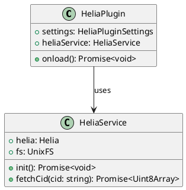

# ADR: Интеграция Helia для доступа к IPFS

## Контекст

Плагину Obsidian требуется возможность получать данные из сети IPFS. Это позволит пользователям, например, вставлять в свои заметки контент, хранящийся в IPFS, по его Content Identifier (CID). Для реализации этой функциональности была выбрана библиотека Helia, которая является легковесной реализацией IPFS на JavaScript.

## Принятое решение

Для инкапсуляции логики взаимодействия с Helia и чистоты кода будет создан отдельный сервис `HeliaService`.

1.  **Создание `HeliaService`**: Будет создан новый модуль (`src/helia/index.ts`), который будет отвечать за:
    *   Инициализацию узла Helia (`createHeliaHTTP`).
    *   Предоставление функций для взаимодействия с IPFS, в первую очередь для получения данных по CID (например, `fetchCid`).

2.  **Интеграция в `HeliaPlugin`**: Основной класс плагина (`src/main.ts`) будет:
    *   Импортировать и инициализировать `HeliaService` на этапе `onload`.
    *   Использовать экземпляр сервиса для выполнения команд, связанных с IPFS.

3.  **Диаграмма классов**: Ниже представлена диаграмма, иллюстрирующая предлагаемую архитектуру.

## Последствия

### Положительные
-   **Инкапсуляция**: Вся логика, связанная с IPFS, будет изолирована в одном модуле, что упрощает ее понимание и поддержку.
-   **Переиспользуемость**: `HeliaService` может быть легко переиспользован в других частях плагина.
-   **Тестируемость**: Изолированный сервис легче тестировать.

### Отрицательные
-   Незначительное усложнение структуры проекта за счет добавления нового модуля.
