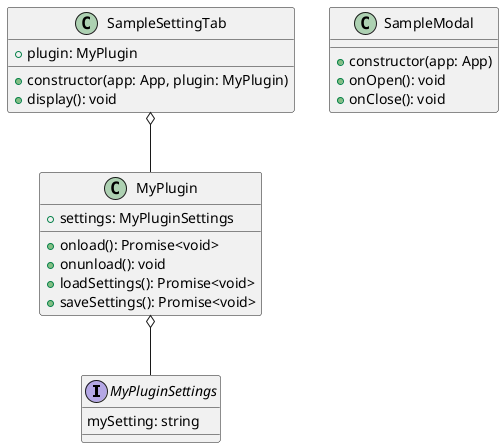

# Class Diagram

This document describes the class structure of the plugin.

## Class Descriptions

### `MyPluginSettings`
An interface that defines the structure for the plugin's settings. It ensures type safety for the settings object.

### `MyPlugin`
The main class of the plugin, extending `Plugin` from the Obsidian API. It handles the plugin's lifecycle, including loading and saving settings, adding ribbon icons, status bar items, and commands.

### `SampleModal`
A sample modal window that extends `Modal`. It demonstrates how to create and manage simple modal dialogs within Obsidian.

### `SampleSettingTab`
This class creates the settings tab for the plugin. It extends `PluginSettingTab` and provides the user interface for configuring the plugin's options.
